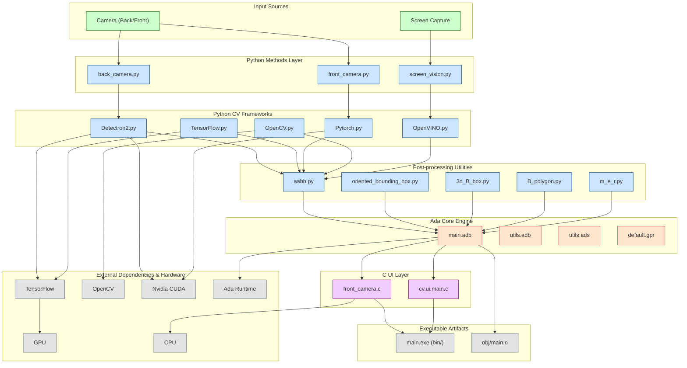

# BlackVision: Computer Vison Framework
A built-in computer vision framework developed for [K.E.N.D.R.A.H-RA1018](https://github.com/BCICDIS/K.E.N.D.R.A.H-RA1018), designed to support real-time object detection, screen capture analysis, and camera-based recognition using modular integrations in C, Ada, and Python. This framework provides the core visual processing capabilities for operator dashboards, system monitoring, and intelligent vision-assisted automation.

# Diagram

